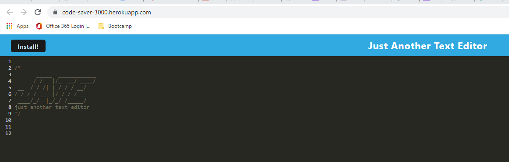
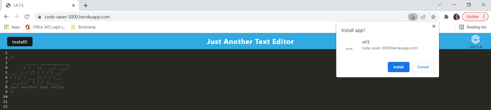

# Code Saver Text Editor

This PWA is a text editor that allows a user to create notes or code snippets with or without an internet connection. The user can then go back to their text editor and access the notes later.

Try it out on Heroku: https://dashboard.heroku.com/apps/code-saver-3000

### Installation:

<ul><li>Clone this repository from the command line: <code>git clone https://github.com/nparker80/code-saver</code></li><li>Change (cd) into the newly created directory</li><li>From the command line, run the command: <code>npm i</code to install all necessary packages</li><li>From the command line, enter: <code>npm run start</code></li></ul>
  
  
(<a href="#top">back to top</a>)

  
  ## Usage
 
Open the application in the browser and enter your desired text below the header. You text will be saved. To use off-line, click the install button to save the application to the desktop.

  
(<a href="#top">back to top</a>)

Homepage

Install PWA

